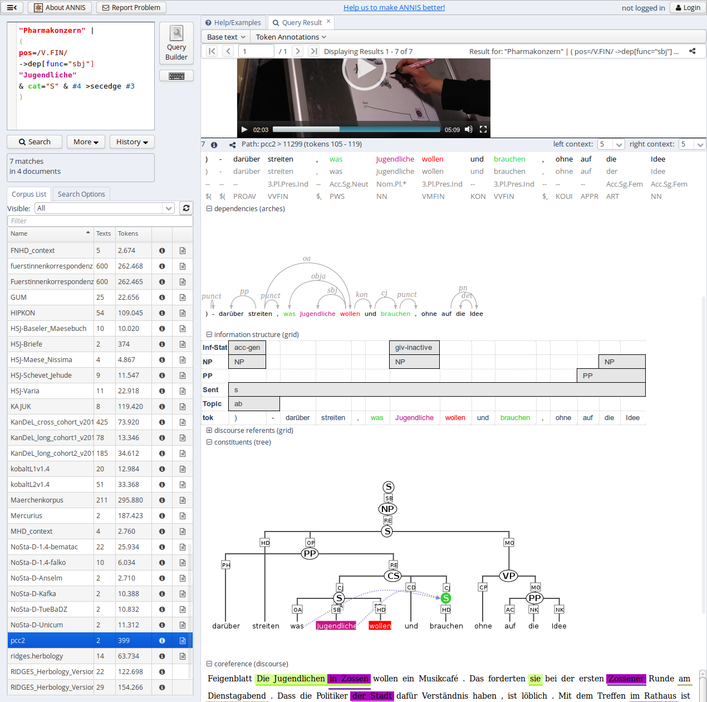
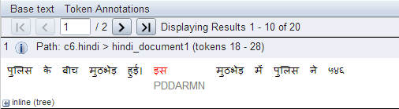
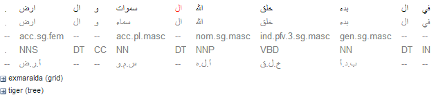
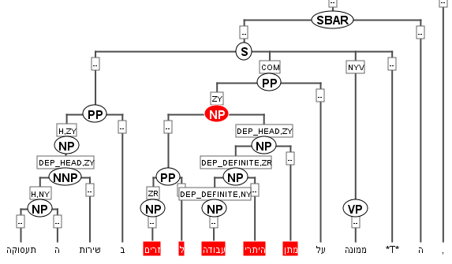
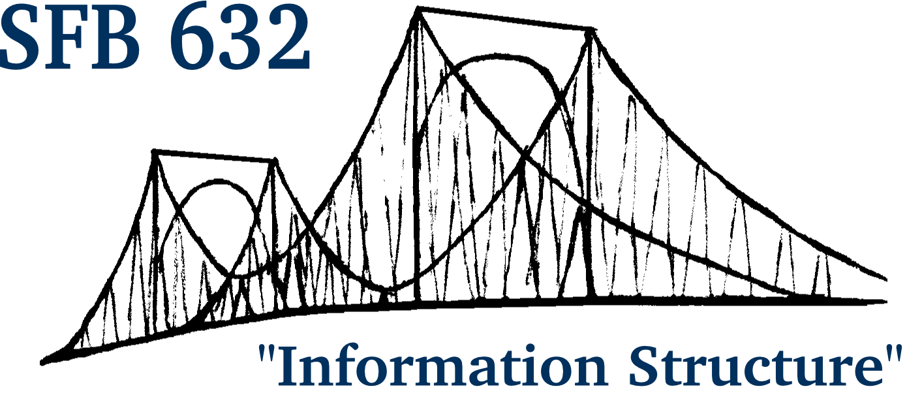

# About ANNIS

<a href="https://korpling.org/annis3/?id=2aec4d6c-1097-4462-8c66-347e2516b11e" target="_blank">
{:style="width:75%"}
</a>

ANNIS is an open source, cross platform (Linux, Mac, Windows), 
web browser-based search and visualization architecture for complex multi-layer 
linguistic corpora with diverse types of annotation. ANNIS, which stands for ANNotation 
of Information Structure, was originally designed to provide access to the data of 
the [SFB 632](http://www.sfb632.uni-potsdam.de/) - "Information Structure: The Linguistic Means for Structuring Utterances, 
Sentences and Texts". It has since then been extended to a large number of [projects](cooperations.html) 
annotating a variety of phenomena. Since complex linguistic phenomena such as 
information structure interact on many levels, ANNIS addresses the need 
to concurrently annotate, query and visualize data from such varied 
areas as syntax, semantics, morphology, prosody, referentiality, 
lexis and more. For projects working with spoken language, support 
for audio / video annotations is also required.

Data is often annotated using both automatic taggers/parsers 
and a growing set of manual annotation tools 
(e.g. [EXMARaLDA](http://exmaralda.org/), [ELAN](https://tla.mpi.nl/tools/tla-tools/elan/), 
[annotate](http://www.coli.uni-saarland.de/projects/sfb378/negra-corpus/annotate.html)/[Synpathy](http://www.mpi.nl/tools/synpathy.html), 
[MMAX](http://mmax2.sourceforge.net/), [RSTTool](http://www.wagsoft.com/RSTTool/), 
[Arborator](http://arborator.ilpga.fr/), [WebAnno](https://code.google.com/p/webanno/), [Hexatomic]({{site.site_hexatomic}})),
ANNIS provides the means for visualizing and retrieving this data. 
[Pepper]({{site.site_pepper}}) is used to import the multiple annotation formats into ANNIS. 

**For detailed information on the latest version of ANNIS see the User Guide under [documentation](documentation.html)**

<article class="anchor" id="howtocite">

# How to cite

If you use ANNIS in your scientific work, please cite it as follows.

<strong>Krause, Thomas &amp; Zeldes, Amir </strong>(2016): <em>ANNIS3: A new architecture for generic corpus query and visualization.</em>   in: Digital Scholarship in the Humanities  2016 (31).
 <a href="http://dsh.oxfordjournals.org/content/31/1/118" target="_blank">http://dsh.oxfordjournals.org/content/31/1/118</a>
</article>

<article class="anchor" id="access">

# Public ANNIS installations 

ANNIS can be installed locally on your computer but there are also public available installations which can be used without any installation.

* [Humboldt-Universität zu Berlin, Corpus Linguistics and Morphology ](https://korpling.german.hu-berlin.de/annis3/) has a number of mostly smaller corpora available without a login.
* The [Georgetown University ANNIS](http://corpling.uis.georgetown.edu/annis-corpora/) runs some freely
  available corpora
* The [SFB 632](https://korpling.german.hu-berlin.de/annis3/) instance for SFB researchers and other partners (login
  required) is now moved to [https://korpling.german.hu-berlin.de/annis3/](https://korpling.german.hu-berlin.de/annis3/).
* The latest experimental [developer's version](https://korpling.german.hu-berlin.de/annis3-snapshot/) for testing.
</article>

<article>

# Challenges and Goals

## Diversity of primary data

Language data can be very heterogeneous and may come from
typologically diverse languages. It differs with respect to modality
(written vs. spoken language, monologue vs. dialogue) and basic unit
(sentence vs. discourse). In addition, special character sets (e.g.
for Hindi, Old High German or the African Kwa languages) mean that full
**Unicode** support is essential, in both visualization and search facilities.
The system also offers support for **right-to-left**
script languages, such as Arabic and Hebrew. This includes **right-to-left
tree layouting** for treebanks in
these languages.

{:style="width:100%"} 

**ANNIS supports Unicode in both visualization and search,
including Regular Expressions** 

{:style="width:100%"} 

**Right-to-left Arabic data in the KWIC view**

{:style="width:100%"} 

**Right-to-left layouting for trees in Hebrew**

## Diversity of Annotation

Data is annotated on various linguistic levels: phonetics/phonology,
morpho-syntax, semantics, and information structure.
The data types of the annotation range from attribute-value pairs to
set relations (e.g. for annotating co-reference), directed
relations/pointers (e.g. for annotating anaphoric relations), trees,
and graphs (see [Visualizations](visualizations.html)).
Furthermore, the annotations are created with the help of different
tools, i.e. different tool formats have to be supported. In order to ensure
compatibility with as many formats as possible, we use the [Pepper converter framework](../pepper/index.html),
which maps a large number of formats via the metamodel Salt into the native format of ANNIS.

## Multi-layer Annotation
A very central requirement is support for visualizing and querying
annotations on multiple layers, each layer representing one type of
information, e.g. morphemic transcription, grammatical functions, pitch
accents, etc. Queries must be able to simultaneously constrain all
these layers and the relationships between them, making operators for
the description of topological tree structures as well as span overlap
necessary.
The system also supports parallel corpora aligned at all levels (i.e. words, sentences, syntactic phrases etc. can be aligned), and each aligned language may have its own annotation layers.

{:style="width:52%"}  
**Parallel aligned data with a separate syntax tree for each language**  

## Accessibility

Data in the database should be easy to access and to query. Software
and hardware requirements on the client side should be limited to a
freely available browser (e.g. Mozilla Firefox). As little training as
possible should be required, making a graphical query builder as well
as corpus-specific example queries and tutorials necessary.

## Performance and Scalability

Queries should return results reasonably quickly, even in large datasets. In order to realize this, the original data from XML and other formats is compiled and stored in the ANNIS backend within a relational database ([PostgreSQL](http://www.postgresql.org/)),
which offers scalability and access speed not feasible for an XML DB,
as well as native RegEx support.

</article>

<article>

# Contact

For enquiries, e-mail us at: <a href="mailto:annis@corpus-tools.org">annis@corpus-tools.org</a>

# Credits

Current team members:

* [Thomas Krause](http://u.hu-berlin.de/korpling-thomaskrause) (Humboldt-Universität zu Berlin)
* [Amir Zeldes](http://corpling.uis.georgetown.edu/amir) (Georgetown University)
* Martin Klotz
* [Anke Lüdeling](https://www.linguistik.hu-berlin.de/en/institut-en/professuren-en/korpuslinguistik/mitarbeiter-innen-en/anke/standardseite?set_language=en) (Humboldt-Universität zu Berlin)

Former team members:

* [Arne Neumann](https://github.com/arne-cl)
* Benjamin Weißenfels
* [Carolin Odebrecht](https://www.linguistik.hu-berlin.de/en/institut-en/professuren-en/korpuslinguistik/mitarbeiter-innen-en/carolin/standardseite) (Humboldt-Universität zu Berlin)
* [Christian Chiarcos](http://acoli.informatik.uni-frankfurt.de/~chiarcos)
* [Florian Zipser](http://www.linguistik.hu-berlin.de/institut/professuren/korpuslinguistik/mitarbeiter-innen/florian/) (LAUDATIO, Humboldt-Universität zu Berlin)
* Karsten Hütter
* [Manfred Stede](http://www.ling.uni-potsdam.de/~stede/)
* Michael Götze
* [Ulf Leser](https://www2.informatik.hu-berlin.de/~leser/) (Humboldt-Universität zu Berlin)
* [Shuo Zhang](http://zangsir.weebly.com/) (Georgetown University)
* [Stefanie Dipper](https://www.linguistics.ruhr-uni-bochum.de/~dipper/)
* Tom Ruette
* Viktor Rosenfeld
* and several other [contributors](https://github.com/korpling/ANNIS/graphs/contributors)
</article>

## Supported by

[{:width="100"}](https://www.linguistik.hu-berlin.de/institut/professuren/korpuslinguistik/standardseite-en?set_language=en&amp;cl=en)
[{:width="150"}](https://www.sfb632.uni-potsdam.de/en/)
[{:width="250"}](http://www.dfg.de/en/)
[{:width="120"}](https://corpling.uis.georgetown.edu/)

