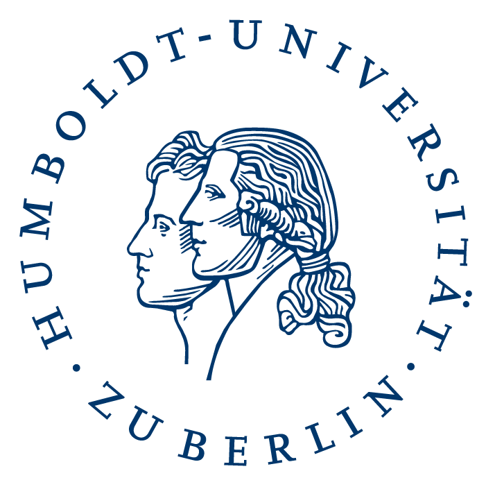



# About Atomic

Atomic has been originally developed in the context of **Towards a corpus-based typology of clause linkage - An analytical framework and case studies on non-local dependencies** ([**LinkType**](http://linktype.iaa.uni-jena.de/)), a [DFG](http://www.dfg.de/)-funded linguistic research project that is jointly carried out by the universities of [Zurich](http://www.linguistik.uzh.ch/index_en.html) and [Jena](http://www.anglistik.uni-jena.de/en/). The project aims at statistically modeling linguistic variation in the area of complex sentences. It is based on the investigation of corpora from genealogically and geographically diverse languages that have been richly annotated.

Atomic is built as an open source annotation software for multi-layer deep linguistic annotation of text corpora. It is based on the Eclipse RCP, a modular rich client platform implemented in Java, and hence extensible via plugins.

Atomic works on a concrete implementation of the generic graph-based meta-model [Salt]({{site.site_salt}}), and embeds its complementary conversion framework [Pepper]({{ site.site_pepper }}), allowing for n : m mapping between data formats.

### Development status

In the context of the LinkType project, Atomic has been developed as an architectural prototype, i.e., as a test bed for an extensible, sustainable annotation *platform*. Hence, all current functionality must be considered **experimental**, i.e., unstable and due to change.

**Currently, Atomic is being developed towards an initial <i>stable release</i>.**

To track progress, have a look at the *development* branch on [GitHub]({{ page.VAR_github }}). We aim for a transparent development process via issues and the *Features* project on the GitHub site. Feel free to file an issue if you want to contribute.

<article class="anchor" id="how-to-cite">

# How to cite

If you use <strong>Atomic</strong> in your scientific work, please cite it as follows.

 <strong>Druskat, Stephan, Lennart Bierkandt, Volker Gast, Christoph Rzymski &amp; Florian Zipser. 2014. <i>Atomic: an open-source software platform for multi-layer corpus annotation</i>.</strong> In Josef Ruppert and Gertrud Faaß (eds.): Proceedings of the 12th Konferenz zur Verarbeitung natürlicher Sprache (KONVENS 2014), Hildesheim, October 2014. 228&ndash;234. ISBN 978-3-934105-46-1. <a class="fa fa-file-pdf-o" href="http://nbn-resolving.de/urn:nbn:de:gbv:hil2-opus-2866"> PDF</a>

</article>

<article class="anchor" id="download">

# Download

Atomic is currently being developed towards an initial stable release.

Past experimental releases have been removed.

To receive updates about releases, please subscribe to the Atomic users mailing list: <a class="fa fa-envelope-o" href="https://lserv.uni-jena.de/mailman/listinfo/atomic-user"> atomic-user</a>. Subscribers to the list will be notified of any releases.

</article>



<article>

## <i class="fa fa-envelope"></i> Contact

### Atomic

For Atomic-related questions, please write a message to the atomic-user mailing list:

<a onmouseover="setEmailStatus('atomic-user', 'listserv.uni-jena', 'de'); return true;" onmouseout="status=''; return true;" onclick="sendEmail('atomic-user', 'listserv.uni-jena', 'de', ''); return false;" href="javascript:sendEmail('atomic-user',%20'listserv.uni-jena',%20'de',%20'')" target="_self"> atomic-user &#x40; listserv · uni-jena · de</a>

### LinkType

For questions related to the LinkType research project, please consult the project website:
[http://linktype.iaa.uni-jena.de/](http://linktype.iaa.uni-jena.de/)

## <i class="fa fa-fast-forward"></i> Keep up to date

Subscribe to the Atomic users mailing list: <a class="fa fa-envelope-o" href="https://lserv.uni-jena.de/mailman/listinfo/atomic-user"> atomic-user</a>.

Subscribe to the Atomic developers mailing list: <a class="fa fa-envelope-o" href="https://lserv.uni-jena.de/mailman/listinfo/atomic-dev"> atomic-dev</a>.

<!--/.col-md-3-->

## <i class="fa fa-info-circle"></i> Impressum

The following information (Impressum) is required under German law.

Responsible for the content of this site:  
Volker Gast  
Friedrich Schiller University Jena  
Institut für Anglistik und Amerikanistik  
Ernst-Abbe-Platz 8  
07743 Jena  
Germany  
Tel: +49 (0)3641 944500  
 <a onmouseover="setEmailStatus('atomic', 'corpus-tools', 'org'); return true;" onmouseout="status=''; return true;" onclick="sendEmail('atomic', 'corpus-tools', 'org', ''); return false;" href="javascript:sendEmail('atomic',%20'corpus-tools',%20'org',%20'')" target="_self">atomic &#x40; corpus-tools · org</a>

<!--/.col-md-3-->

</article>

<article id="supporters">

<h1>Supported by</h1>
  

&nbsp;&nbsp;&nbsp;
&nbsp;&nbsp;&nbsp;

</article>