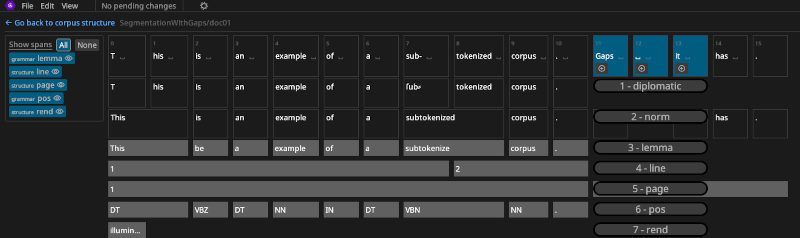
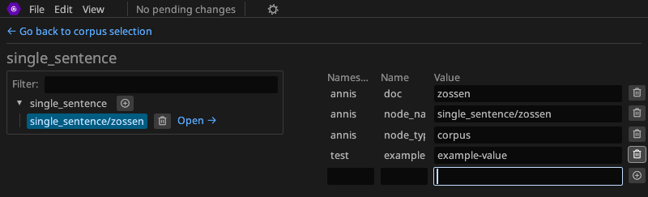
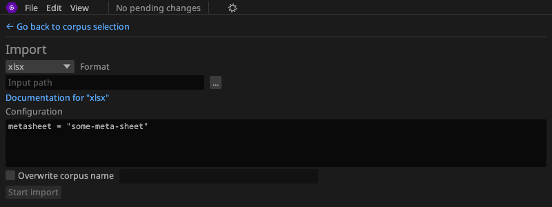



The Annatomic annotation editor is intended to be used for the [RIDGES corpus](https://www.linguistik.hu-berlin.de/en/institut-en/professuren-en/korpuslinguistik/research/ridges-projekt).
It is based on [graphANNIS](../graphannis) and thus is internal data model is in principle suitable for a wide range of annotation concepts.

It is very much **work in progress**.
We support Linux, Windows and (with delayed manual relases) macOS, but only activly test on Linux.
See the [Releases](https://codeberg.org/korpling/annatomic/releases) page to download the files for your operating system.

## Features

- Import and export corpora in the most formats supported by [annatto](../annatto)
- Supports editing several token layers (RIDGES has diplomatic transcription and two normalization layers)
- Supports span annotations
- Edit the corpus structure and change meta data

## Screenshots

