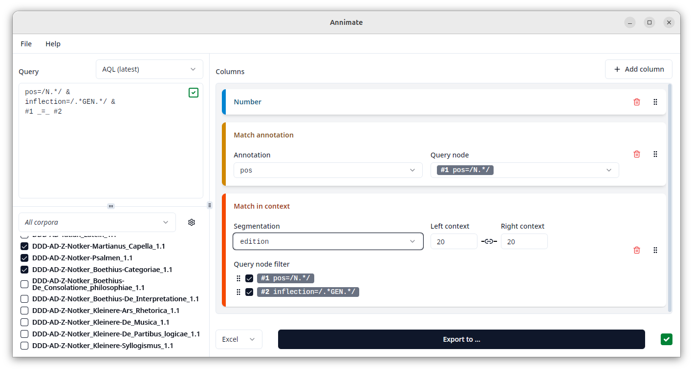

# Third-Party Tools

## Annimate: Your Friendly ANNIS Match Exporter

Annimate (for ANNIS Match Exporter) is a tool for the convenient export of query results (matches) from the [ANNIS](../annis).
It is meant as a supplement to the ANNIS web interface and focuses on file export (as opposed to visualization) of the results of an ANNIS query.

Website: <https://matthias-stemmler.github.io/annimate/user-guide/>

---

If you think your tool should be mentioned here, please write an e-mail to thomas.krause@hu-berlin.de
