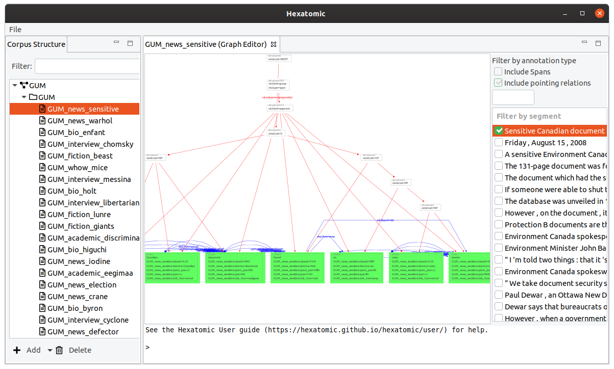

<article>

# About Hexatomic

Hexatomic is an extensible, OS-independent platform for deep multi-layer linguistic annotation of corpora.

It is being developed for sustainability, in order to support research software re-use rather than new development of software with each new research project. Using Hexatomic, linguistic research projects can implement what they need on top of an existing platform with high compatibility to other tools and pipelines.

Hexatomic is funded by [Deutsche Forschungsgemeinschaft (DFG)](https://www.dfg.de/en/) under grant number [391160252](https://gepris.dfg.de/gepris/projekt/391160252?language=en).

Development is based at the [Department of English Studies (Friedrich Schiller University Jena)](https://www.iaa.uni-jena.de/en/) and the [Department for German Studies and Linguistics (Humboldt-Universität zu Berlin)](https://www.linguistik.hu-berlin.de/de).

**Project Homepage**: <https://hexatomic.github.io/>

{:style="height:300px"} 
{:style="height:300px"} 

</article>
