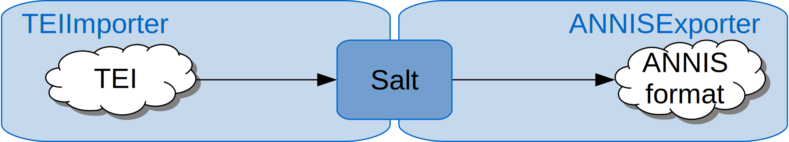

<div class="page-header">
# Demos
</div>

Let's pepper! Here we want to show some sample workflows for Pepper.

<div class="page-header">
# PAULA -> ANNIS
</div>


The pcc2 corpus is a small excerpt from the {{site.link_pcc}}. It contains the two documents *1299* and *4282*. 
The corpus is annotated on multiple layers: constituents, dependencies, coreference, rhetorical structure and information structure.

The aim of this workflow is to convert the corpus from its source format PAULA into its target format, the ANNIS format.

|**corpus**  | [<i class="fa fa-download"></i> Potsdam Commentary Corpus](..{{site.site_corpora}}pcc2.zip) |
|**importer**| [{{site.module_paula}}]({{site.module_paula}}) |
|**exporter**| [{{site.module_annis}}]({{site.module_annis}}) |
{: .table .table-striped}


{: width="60%" .center-block}

The following workflow assumes the source file to be in a folder named *paula*, which is in the same folder as the workflow description file itself. The target format will be exported to a folder named *annis*.

```
<?xml version="1.0" encoding="UTF-8"?>
<?xml-model href="https://korpling.german.hu-berlin.de/saltnpepper/pepper/schema/10/pepper.rnc" type="application/relax-ng-compact-syntax" ?>
<pepper-job version="1.0">
	<importer name="PAULAImporter" path="./paula/"/>
	<exporter name="ANNISExporter" path="./annis/"/>
</pepper-job>
```

<div class="page-header">
# EXMARaLDA -> corpus homepage
</div>

The Tatian Corpus of Deviating Examples T-CODEX 2.1, provides morpho-syntactic and information structural annotation of parts of the Old High German translation attested in the MS St. Gallen Cod. 56, traditionally called the OHG Tatian, one of the largest prose texts from the classical OHG period. This corpus was designed and annotated by Project B4 of Collaborative Research Center on Information Structure at Humboldt University Berlin. .

The aim of this workflow is to create a homepage for this corpus. This is done by the SaltInfoExporter, which produces an xml output for further processing and an html output. The html output is an overview of all annotations (names, values, occurences) used in the corpus.

|**corpus**  | [<i class="fa fa-download"></i> b4.tatian](..{{site.site_corpora}}b4.tatian.zip) |
|**importer**| [{{site.module_exmaralda}}]({{site.module_exmaralda}}) |
|**exporter**| [{{site.module_saltInfo}}]({{site.module_saltInfo}}) |
{: .table .table-striped}


{: width="60%" .center-block}

The following workflow assumes the source corpus to be in a folder named *exmaralda*, which is in the same folder as the workflow description file itself. The corpus homepage will be exported to a folder named *site*. Since the corpus homepage can be customized by adapting the file *customization.json*, this file and referred images are stored in a folder named *custom*. At the end of the conversion process, these files are copied into the target folder *site*. This is done by the customization property *pepper.after.copyRes*, which copies any files from a source to a target folder (source -> target) when the conversion process was done.

```
<?xml version="1.0" ?>
<?xml-model href="https://korpling.german.hu-berlin.de/saltnpepper/pepper/schema/10/pepper.rnc" type="application/relax-ng-compact-syntax"?>
<pepper version="1.0">
	<importer name="EXMARaLDAImporter" path="./exmaralda/b4.tatian"/>
	<exporter name="SaltInfoExporter" path="./site/">
		<property key="theme">historic</property>
  		<property key="pepper.after.copyRes">./custom/customization.json->./site/;./custom/impressum.html->./site/;./custom/faksi1.png->./site/img/;./custom/faksi2.png->./site/img/</property>
	</exporter>
</pepper>
```


<div class="page-header">
# TEI -> ANNIS
</div>

The MaKoHiZZ Corpus is a historical newspaper corpus build by the IDS Mannheim. The test corpus contains just one document “khz01001” which is encoded in TEI XML.

The aim of this workflow is to convert the corpus from TEI XML to ANNIs format.

|**corpus**  | [<i class="fa fa-download"></i> MaKoHiZZ](..{{site.site_corpora}}MaKoHiZZ.zip) |
|**importer**| [{{site.module_tei}}]({{site.module_tei}}) |
|**exporter**| [{{site.module_annis}}]({{site.module_annis}}) |
{: .table .table-striped}


{: width="60%" .center-block}

The following workflow assumes the source file to be in a folder named /testMaKoHiZZ/, which is in the same folder as the workflow description file itself. The target format will be exported to a folder named /ANNIS/.

The metadata in the teiHeader are customized in two ways. Some XML paths are ignored in the workflow and some are replaced with shorter keys.

```
<?xml version="1.0" ?>
<?xml-model href="https://korpling.german.hu-berlin.de/saltnpepper/pepper/schema/10/pepper.rnc" type="application/relax-ng-compact-syntax"?>
<pepper-job version="1.0">
	<importer name="TEIImporter" path="./testMaKoHiZZ/">
		<customization>
			<property key="token.tokenize">true</property>
			<property key="token.tokenize.lang">de</property>
			<property key="annotation.token.span">true</property>
			<property key="element.generic.node">span</property>
			<property key="element.generic.attribute">true</property>
			<property key="metadata.remove">true</property>
			<property key="metadata.remove.list">/fileDesc/publicationStmt/idno;/fileDesc/publicationStmt/idno/@type;/fileDesc/publicationStmt/date/@when;/fileDesc/sourceDesc/p;/profileDesc/creation/name/@type;/profileDesc/creation/date/@when;/encodingDesc/editorialDecl/p;</property>
			<property key="metadata.rename">/fileDesc/titleStmt/respStmt/resp:Conversion;/profileDesc/creation/date:Creationdate;/profileDesc/creation/name:Creationname;/fileDesc/publicationStmt/date:Date;/encodingDesc/editorialDecl/hyphenation/p:Description;/fileDesc/titleStmt/respStmt/name:Editor;/encodingDesc/editorialDecl/p[2]:Editorialdeclaration;/fileDesc/titleStmt/funder:Funder;fileDesc/publicationStmt/idno:Identificationnumber;/fileDesc/publicationStmt/availability/p:Licence;/encodingDesc/editorialDecl/p[3]:Normalization;/fileDesc/titleStmt/sponsor:Project;/fileDesc/publicationStmt/pubPlace:Publicationplace;/fileDesc/sourceDesc/p[2]:Sourcedescription;title:Title</property>
		</customization>
	</importer>
	<exporter name="ANNISExporter" path="./ANNIS/"/>
</pepper-job> 
```
