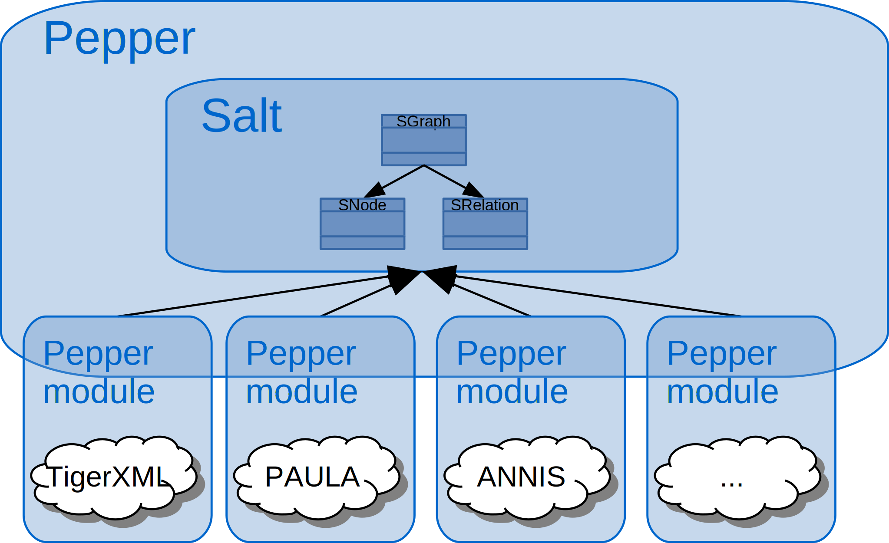

# About Pepper

If you need to convert corpora from one linguistic format into another, Pepper is your swiss-army knife. 
When your annotation tool produces a different data format from the one your analysis tool can read, Pepper is there to the rescue.

* Pepper can convert documents in a variety of linguistic formats, such as: {{site.link_exmaralda}}, {{site.link_tigerxml}}, {{site.link_mmax2}}, {{site.link_rst}}, [TCF](http://weblicht.sfs.uni-tuebingen.de/weblichtwiki/index.php/The_TCF_Format), {{site.link_treetagger}} format, [TEI](http://www.tei-c.org/Guidelines/P5/) (subset), [ANNIS](../annis/) format, {{site.link_paula}} and [many many more](..{{site.site_pepper}}knownModules.html).
* Pepper comes with a plug-in mechanism which makes it easy to extend it for further formats and data manipulations.
* Pepper is module-based, each mapping is done by a separate module. This enables each module to be combined with every other module in one single workflow.
* Pepper uses the intermediate model [Salt](..{{site.site_salt_main}}) which reduces the number of mappings to convert _n_ into _m_ formats.
* Pepper modules, such as the [MergingModule]({{site.pepper_doc_moduleDev}}), allow to merge the data from different annotation tools together and create multi-layer corpora.
* Pepper can be used as an interactive command line tool, as a command to be included in scripts, or as an API to be integrated in other software products.
* Pepper is written in [Java](https://adoptium.net/?variant=openjdk11&jvmVariant=hotspot) and can be run on all operation systems which are ready to run Java (Windows, Mac, Linux, Unix, ...).
* Pepper is free and open source software. It is distributed under the {{site.apache_license}}.

To decrease the number of conceptual mappings, Pepper uses an intermediate model, which means that a conversion consists of two mappings. First, the data coming
from format _X_ will be mapped to the intermediate model Salt and second, the data will be
mapped from Salt to format _Y_. If you imagine a set of _n_ source and target formats, this
approach will decrease the number of mappings from _n²-n_ mappings in case of a direct
mapping approach, to _2n_ mappings. 

Pepper itself is a platform controlling the workflow of a conversion
process. The mapping itself is done by a set of Pepper modules. Pepper is a highly pluggable
platform which offers the possibility to plug-in new modules in order to incorporate
further formats. The flexible architecture of Pepper allows to combine all existing modules
and to easily plug in new ones. 

<article class="anchor" id="download">

<h1>Download</h1>

Here you will find the current stable release, snapshots, and also
older versions of Pepper, including a set of Pepper modules.

* [Stable Releases](https://korpling.german.hu-berlin.de/saltnpepper/pepper/download/stable/)
* [Snapshot Releases](https://korpling.german.hu-berlin.de/saltnpepper/pepper/download/snapshot/)

Pepper is system-independent and comes as a ready-to-run zip archive, so you do
not need any installation. But since Pepper is Java-based, you need to have Java
installed on your system. On most systems, Java is installed by default, but in case it
is not, please download it from www.oracle.com/technetwork/java/javase/ or
http://openjdk.java.net/. To check if Java (or more precisly a Java Runtime Environment)
is running, open a command line and run: 
<pre>
java -version 
</pre>
You need at least version 1.8, also called "Java 8".
</article>

<article class="anchor" id="howtocite">

# How to cite

If you use Pepper in your scientific work, please cite it as follows.

F. Zipser &amp; L. Romary (2010). <strong>A model oriented approach to the mapping of annotation formats using
standards</strong>. In: <em>Proceedings of the Workshop on Language
Resource and Language Technology Standards, LREC 2010. Malta.</em> URL: [http://hal.archives-ouvertes.fr/inria-00527799/en/](http://hal.archives-ouvertes.fr/inria-00527799/en/)

</article>

<article>

# Documentation
{: #documentation .anchor}

## User documentation

Users new to Pepper should begin by reading the [User Guide](./userGuide.html)

## Create your own Pepper module (Module Developers's Guide)

f there is no [existing module](..{{site.site_pepper}}knownModules.html) which fulfills your needs, you are free to
implement your own module. With Pepper's plug-in mechanism your module can
easily be integrated into the Pepper plattform. The possibility of combining
your new module with already existing ones lets you create completely new workflows.
Please read the [Module Developer's Guide](http://korpling.github.io/pepper/doc/module_developers.html) to get a detailed documentation of how to implement a Pepper module.

## Using Pepper as a library
With the Pepper library, we provide a programmatic access to the Pepper framework,
including the configuration of a conversion workflow, the start of a conversion
and getting information about the registered Pepper modules. Since Pepper is based
on a plugin structure called OSGi (see: [http://www.osgi.org/](http://www.osgi.org/)), each Pepper module is plugged into the framework
separately, whether running Pepper as CLI, or running it as a
library.

To learn more about integrating Pepper as a library in other software products go to [Pepper as a library](https://korpling.github.io/pepper/doc/library.html).

</article>

<article class="anchor" id="contribution">

   <h1>Contribution and License</h1>

Pepper is published under the Open Source license {{site.apache_license}}. We want to enable everyone to use the software without restrictions, and also enable the community to take part in its developement.

#### Found a bug or have any feature request?

Please let us know what you have found, or which ideas for enhancements you have. Please leave us an issue on
GitHub at <a href="{{ site.github_pepper }}/issues"><i class="fa fa-github"></i> Pepper</a>
or write us an e-mail: <a href="mailto:{{ site.email_snp }}">{{ site.email_snp }}</a>.
 

#### Want to contribute to the project?

For both Salt and Pepper, we have published the source code at the GitHub platform at <a href="{{ site.github_pepper }}"><i class="fa fa-github"></i> Pepper</a>.
If you are interested in contributing
to the project, please feel free to fork or clone it. We are happy about any
suggestions, bug reports, bug fixes, and so on. It would be nice if you keep us
informed about your ideas and enhancements: Please write us an e-mail: <a href="mailto:{{ site.email_snp }}">{{ site.email_snp }}</a>. 

</article>

<article id="publications">

   <h1>Publications</h1>

   <ul>
       <li> F. Zipser, A. Röhrig, A. Lüdeling, M. Klotz,T. Krause, S. Druskat &amp; V.
           Voigt (2015). 
           <strong>SaltNPepper, ANNIS &amp; Atomic: Eine Infrastruktur für
               Mehrebenenkorpora</strong>. 
           <i>Digital Humanities“-Tag 2015 – Digitale Ressourcen an der Philosophischen
               Fakultät II.</i> Berlin, 21. Mai 2015. [<a
               href="http://dx.doi.org/10.5281/zenodo.20714">poster</a>].</li>
       <li> F. Zipser, T. Krause, A. Lüdeling, A. Neumann, M. Stede, A. Zeldes (2015). 
           <strong>ANNIS, SaltNPepper &amp; PAULA: A multilayer corpus
               infrastructure</strong>. 
           <i>Final Conference of the SFB 632 Information Structure: Advances in
               Information Structure Research 2003 - 2015.</i> Berlin, 08. - 09. Mai 2015.
               [<a href="http://dx.doi.org/10.5281/zenodo.20713">poster</a>].</li>
       <li> F. Zipser, M. Klotz &amp; A. Röhrig (2015). 
           <strong>From TEI to linguistic corpora using Pepper</strong>. 
           <i>37. Jahrestagung der Deutschen Gesellschaft für Sprachwissenschaft.</i>
           Leipzig, 04.- 06. März 2015. [<a href="http://dx.doi.org/10.5281/zenodo.16664"
               >poster</a>].</li>
       <li> Zipser, F. (2014). 
           <strong>SaltNPepper und das Formatpluriversum</strong>. 
           <i>LAUDATIO Workshop 2014</i>. Berlin, 07.- 08.10.2014.<a
               href="http://dx.doi.org/10.5281/zenodo.17557">[slides]</a>.</li>
       <li> F. Zipser, M. Frank &amp; J. Schmolling (2014). 
           <strong>Merging data, the essence of creation of multi-layer corpora</strong>. 
           <i>36. Jahrestagung der Deutschen Gesellschaft für Sprachwissenschaft.</i>
           Marburg, 05.- 07. März 2014. [ <a href="http://dx.doi.org/10.5281/zenodo.15640"
               >poster</a>].</li>
       <li> C. Odebrecht &amp; F. Zipser (2013). 
           <strong>LAUDATIO - Eine Infrastruktur zur linguistischen Analyse historischer
               Korpora.</strong>  DTA-/CLARIN-D Konferenz und -Workshops: Historische
           Textkorpora für die Geistes- und Sozialwissenschaften. Fragestellungen und
           Nutzungsperspektiven, Berlin 2013.</li>
       <li> F. Zipser, A. Zeldes, J. Ritz, L. Romary &amp; U. Leser (2011). 
           <strong>Pepper: Handling a multiverse of formats</strong>. 
           <i>33. Jahrestagung der Deutschen Gesellschaft für Sprachwissenschaft.</i>
           Göttingen, 23.- 25. Februar 2011. [ <a
               href="http://dx.doi.org/10.5281/zenodo.15638">poster</a>].</li>
       <li> F. Zipser &amp; L. Romary (2010). 
           <strong>A model oriented approach to the mapping of annotation formats using
               standards</strong>.  In: <i>Proceedings of the Workshop on Language
               Resource and Language Technology Standards, LREC 2010. Malta.</i> URL: <a
               href="http://hal.archives-ouvertes.fr/inria-00527799/en/"
               >http://hal.archives-ouvertes.fr/inria-00527799/en/</a></li>
       <li> F. Zipser (2009). 
           <strong>Entwicklung eines Konverterframeworks für linguistisch annotierte Daten
               auf Basis eines gemeinsamen (Meta-)modells</strong>.  Diplomarbeit,
           Humboldt-Universität zu Berlin, Institut für Informatik. URL: <a class="fa fa-file-pdf-o"
               href="http://hal.archives-ouvertes.fr/docs/00/60/61/02/PDF/Diplomarbeit_FZ_final.pdf"
               > http://hal.archives-ouvertes.fr/docs/00/60/61/02/PDF/Diplomarbeit_FZ_final.pdf</a></li>
   </ul>

</article>

# Supported by

[{:width="150"}](https://www.sfb632.uni-potsdam.de/en/)
[{:width="250"}](http://www.dfg.de/en/)
[{:width="100"}](https://www.linguistik.hu-berlin.de/institut/professuren/korpuslinguistik/standardseite-en?set_language=en&amp;cl=en)
[{:width="150"}](http://www.inria.fr/en)

