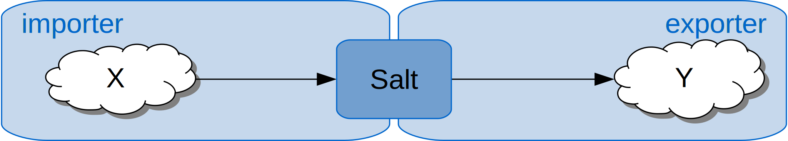
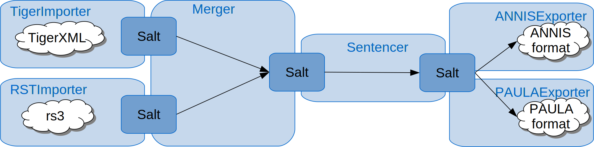

<div class="page-header">
# User Guide
{: .no_toc}
</div>

* TOC 
{:toc}

## Overview
{: .anchor}

The conversion process in Pepper is defined by a workflow. Such a workflow is normally stored in an xml file and is separated into three different
phases: 
* the import phase (mapping data from a given format to Salt),
* the optional manipulation phase (manipulating or enhancing data in Salt) and the
* export phase (mapping data from Salt to a given format).

The three-phase process makes it feasible to influence and manipulate data during
conversion, for example by adding additional information or linguistic annotations, or by
merging data from different sources.

The import phase handles the mapping from a format *X* to Salt, the export phase handles the mapping from Salt to a format *Y*. During the
manipulation phase, the data in Salt can be enhanced, reduced or manipulated. A phase is
divided into several steps. Each step is done by exactly one module. A module handling an import phase step is called importer, a module handling a manipulation phase step is called manipulator and a module handling an export phase step is called exporter. The import and export phase must contain at least one step each, whereas the manipulation phase can contain any number of steps. Each Pepper module realizes
exactly one step. 

{: width="60%" .center-block}


A Pepper module can be identified by specifying
its name or the format's name and version of the corpus to be converted.
For instance the import of data in the EXMARaLDA format is done by a
module called EXMARaLDAImporter and the export into the ANNIS format is done by a module called ANNISExporter. 

{: width="60%" .center-block}


The orchestration of Pepper modules can be persisted by the
Pepper workflow description file (.pepper).

The modules can be freely combined, e.g., we can exchange the EXMARaLDAImporter with the TigerImporter and still export the data to ANNIS. **But** you have to take care, that the target format can handle those data, otherwise they will be ignored. For instance converting data coming from the Tiger format to EXMARaLDA does not make a lot of sense, since EXMARaLDA can not handle syntax trees. Nevertheless, even such transformations are allowed in Pepper.

As described above, a Pepper workflow contains three phases: the import phase, the manipulation phase and the export phase. During the manipulation phase you can choose modules ("manipulators"), for instance to enhance the data for further information, such as creating sentences.

{: width="60%" .center-block}

A Pepper workflow can get very complex, for instance when multiple source formats are included, a long manipulation chain is used and/or the data shall be exported to multiple formats at once.

{: width="60%" .center-block }

<div>
A Pepper workflow can be stored to a xml file. The structure of a workflow file is described in <a href="#workflow_file">workflow file</a>. Some real life workflows can be found under <a href="..{{site.site_pepper}}demos.html">Demos</a>.
</div>

## First steps
{: .anchor}

To run Pepper open a command line and enter (for Windows):

    pepperStart.bat

or (for Linux, Unix and Mac OS):

    bash pepperStart.sh

Now Pepper starts the interactive command line and welcomes you with the prompt
    
    pepper>

To get a list of all available commands, enter 'help':

    pepper>help

To get a list of all available modules, enter 'list':

    pepper>list

To start a conversion with a predefined workflow, enter 'convert' followed by the workflow description file:

    pepper>convert myConversion.pepper

To start the interactive conversion wizard, which helps you to define a workflow description, enter just 'convert':

    pepper>convert

## Conversion Wizard
{: #conversion-wizard .anchor}

To run a conversion process with Pepper, you need to define, which modules should be used. This is usually done in a workflow. Remember, the Pepper workflow is separated into three different
    phases: the import phase (mapping data from a given format to Salt), the optional manipulation phase (manipulating or enhancing data in Salt) and
            the export phase (mapping data from Salt to a given format).

The conversion wizzard should help you to create a Pepper workflow, but you can also create such a workflow in an xml file as described in [workflow file](#workflow_file). The wizzard will guide you step by step through the creation of a workflow and will let you store the created workflow to disk when you are done.

* Enter the path of the corpus to import e.g. 'C:\myCorpus\':
```
pepper/wizard/importer>C:\myCorpus\
```
* Now Pepper displays a list of all available importers and asks you to choose one of them.
```
+------+-------------------------------+------------------------------------------+
| no   | module name                   | format                                   |
+------+-------------------------------+------------------------------------------+
| * 1  | TextImporter                  | (txt, 0.0)                               |
|   2  | SaltXMLImporter               | (SaltXML, 1.0)                           |
|   3  | DoNothingImporter             | (doNothing, 0.0)                         |
```
A ```*``` next to the number of the importer shows, that this importer is recommended. Recommended means that the passed path contains files in a format the importer is able to process.
Importers have both a name and a list of supported formats.
E.g. the importer with the number 1 has the module name ```TextImporter``` and supports a single format identified by the format name ```txt``` and the format version ```0.0```.
To choose an importer, just enter its number or its module name.
```
pepper/wizard/importer>1
```
* Some importers provide a list of properties to customize the import. If this is the case, Pepper displays a list of all available customization properties.
```
+----+-------------------------------+------------------------------------------+
| no | property name                 | description                              |
+----+-------------------------------+------------------------------------------+
| 1  | pepper.before.addSLayer       | Consumes a semicolon separated list of   |
|    |                               | names for {@link SLayer} objects. For    |
...
```
To use a property, enter its number or name, followed by '=' and the value of the property.
```
pepper/wizard/importer>1=anyValue
```
* Pepper keeps asking you to enter further customization properties until you enter an empty line.
* Since it is possible to use more than one importer for one workflow, Pepper asks you to enter a further corpus path. To skip that just press 'enter'.
* In Pepper you have the possibility to manipulate the data between the im- and the export phase. Therefore Pepper displays a list of all available manipulators and asks you to enter the number or name of a manipulator. To skip adding a manipulator just press 'enter'.
* Also, manipulators can be customized. When the chosen manipulator provides properties for customization, Pepper displays them and asks you to enter such a property.
* To skip adding further manipulators just press 'enter'.
* Finally, choose an exporter. Pepper shows a list of all available exporters. To choose one of them enter its number or its name.
* Again you have the chance to customize the export by adding some customization properties, if provided. To do so, enter the number or name of a property followed by '=' and the value.
* Along with importers and manipulators, you can add more than one exporter. To stop adding exporters, enter an empty line.
* To save the workflow, enter 'save' followed by a path where to store the file (.pepper). 
```
pepper/wizard>C:\myCorpus\myWorkflow.pepper
```
A workflow file is stored as an xml file and is structured as described in <a href="#workflow_file">workflow file</a>.
* To start the conversion enter 'start'.
```
pepper/wizard>start
```
* To exit and abort the conversion, enter 'exit'.


## Configuring Pepper
{: #configurtion .anchor}


The Pepper home folder contains a folder named 'conf/', here you find two files to adapt the behavior of Pepper. First you can change the logging behavior by adapting the file logback.xml. The default configuration is configured using the INFO log level:
```
<root level="info">
...
</root>
```

A log level determines which types of log messages are printed. The hierarchy is the following (ascending): trace, debug, info, warn, error. That means, when setting the log level to info, warn and error messages are printed, but no trace and debug messages.

Secondly, by adapting the file 'pepper.properties' you can change the processing behavior of Pepper. This file has a key-value notation, which mean an entry has a key, followed by the equal sign and the corresponding value. Here is an excerpt of that file:
```
##########
# Determines where to find the plugins for Pepper $PEPPER_HOME points to the pepper home folder (this is not an environment variable)
##########
pepper.plugin.path=./plugins/

##########
# Determines if Pepper shall measure and display the performance of the used PepperModules
##########
pepper.computePerformance=true

##########
# The maximal number of currently processed SDocument-objects
########## 
pepper.maxAmountOfProcessedSDocuments=4

##########
# Determines if an SDocument-object shall be removed after it was processed by all PepperModules
########## 
pepper.removeSDocumentAfterProcessing=true
```

## Workflow File
{: #workflow_file .anchor}

In Pepper you have the chance to store a workflow in a workflow file (.pepper). This allows you to redo and reuse a configured workflow. You can also add this file to a version control system, to persist the details of how a corpus was processed. A workflow is stored in an xml file following the Pepper scheme. A workflow consists of three phases: import phase, manipulation phase and export phase. The notation of the workflow file follows this structure. To identify a Pepper module realizing a step, you have to describe that module either by its name or the format's name and version.
The following sample consists of three steps, one importer, one manipulator and one exporter:
```
<?xml version="1.0" encoding="UTF-8"?>
<?xml-model href="https://korpling.german.hu-berlin.de/saltnpepper/pepper/schema/10/pepper.rnc" type="application/relax-ng-compact-syntax"?>
<pepper-job version="1.0">
<importer formatName="FORMAT_NAME" formatVersion="FORMAT_VERSION" path="SOURCE_PATH">
<customization>
    <property key="PROPERTY_NAME">PROPERTY_VALUE</property>
</customization>
</importer>
<manipulator name="MANIPULATOR_NAME">
<customization>
    <property key="PROPERTY_NAME_1">PROPERTY_VALUE</property>
    <property key="PROPERTY_NAME_2">PROPERTY_VALUE</property>
</customization>
</manipulator>
<exporter name="EXPORTER_NAME" path="TARGET_PATH"/>
</pepper-job>
```
The importer - in contrast to the exporter - is identified in this example by the format's name (```FORMAT_NAME```) and the format's version (```FORMAT_VERSION```). 
The exporter and the manipulator are identified by their module names (```MANIPULATOR_NAME``` and ```EXPORTER_NAME```). To customize the workflow, some modules provide a set of properties. A property consists of a name-value pair. A description of properties can be found on the modules site or when entering the command 'list' followed by the module name in the pepper console, for instance:
```
pepper>list MANIPULATOR_NAME
```
An importer and an exporter need a source or a target path to address where to find the corpus or where to store it. Such a path can be addressed relative or absolute. A relative path can start with ```./``` for current directory or ```../``` for the parent directory, for instance:
```
./corpus
```
or
```
../corpus
```
An absolute path could start with the file scheme, e.g.:
```
file:/C:/format1/corpus1/
```
or
```
file:///C:/format1/corpus1/
```
or without any scheme:
```
C:/format1/corpus1/
```

Some real life workflows can be found under [Demos]({{site.site_pepper}}demos.html).

### Executing a workflow file
{: .anchor}

When you created the workflow file you can start the conversion process by executing Pepper with the path of the workflow file as argument, e.g. (for Windows)

```
pepperStart.bat /home/user/corpus/myworkflow.pepper
```
or (for Linux, Unix and Mac OS)
```
bash pepperStart.sh /home/user/corpus/myworkflow.pepper
```
